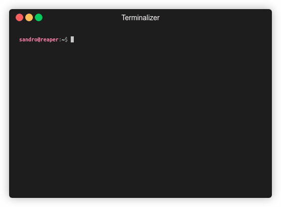

# RecMD5

RecMD5 stands for "recursive MD5" and it is a script to create and update
MD5 checksums for all files in a directory and in its subdirectories. Its
purpose is data integrity validation of all sorts of file structures where git
is unsuitable, like a large movie library. It stores the checksums in a file
right in the top-level directory to make it as simple and portable as possible.
There is no configuration needed nor are there any dependencies or a complex
setup.



## Installation
First go to the cloned repository.
```bash
cd recmd5
```
There are multiple options how to install the script. Two of those are:

### Via Symlink
Create a symbolic link to the shell script in a binary folder:
```bash
sudo ln -s "$(pwd)/recmd5.sh" /usr/local/bin/recmd5
```

### As Alias
Or create a BASH alias in your `.bashrc` or `.bash_aliases`:
```bash
echo "alias recmd5='$(pwd)/recmd5.sh'" >> ~/.bashrc
```
In this case you could also shorten the check command with:
```bash
echo "alias chkmd5='md5sum --check checksums.md5 --quiet'" >> ~/.bashrc
```

## Usage
To generate the checksum list for some file structure, go to the top-level
directory and execute:
```bash
recmd5
```
This will create a file named `checksums.md5` in the top-level directory. When
you add new files and execute this again, only the new checksums will be
added to the list. When executing after deleting some files you will be asked
if you want to remove their checksums as well.

For checking the validity of your data use:
```bash
md5sum -c checksums.md5
```
in the top-level directory. Use the `--quiet` option for skipping output for
valid files or use the alias `chkmd5` suggested above.

When you update files you will have to remove their checksums manually from
`checksums.md5` and execute the program again.

## FAQ

### Why MD5?
You might have heard that MD5 is not secure and you should use stronger
algorithms like SHA256 or SHA512. This is correct for cryptographic purposes
but for file integrity checks MD5 is still totally fine.

It is also a lot faster than SHA algorithms which is a big advantage when using
this on large files like movies.

### Are there alternatives?
[RHash](https://github.com/rhash/RHash) offers basically the same
functionality but implements it directly in C. This might make it a little
faster at times, but depending on your distribution it might also be a tiny
bit more difficult to install. RecMD5 as below 100 line BASH script aims for
maximum simplicity, deployability and portability.

### Aren't there filesystems doing checksumming?
Yes, ZFS for example does a blocklevel checksumming which is a really cool
feature. But you still might want an additional layer of integrity validation
where you have more control. Also does a filesystem-internal checksumming not
help you when you migrate data between filesystems.

## License
This project is distributed under [MIT](LICENSE) license.
